# 👋 Olá, eu sou o Bruno Gabriel!

<div align="center">
  
  [](https://git.io/typing-svg)
  
</div>

## 🚀 Sobre Mim

```javascript
const bruno = {
    idade: 25,
    localização: "Goiás, Brasil 🇧🇷",
    formação: "Engenharia de Software - IFSP São Carlos",
    área: "Desenvolvimento Full Stack",
    paixão: "Tecnologia e Robótica 🤖",
    experiência: [
        "Competições de Robótica desde o Ensino Médio",
        "Desenvolvimento Web Front-end e Back-end",
        "Criação de soluções inovadoras"
    ],
    atualmente: "Construindo projetos incríveis e aprendendo constantemente"
};
```

💡 **Minha Jornada:** Desde o ensino médio me envolvi com robótica, participando ativamente de competições. Essa experiência despertou minha paixão por tecnologia e me levou a seguir carreira em desenvolvimento de software, onde busco criar soluções que fazem a diferença.

---

## 📊 GitHub Stats

<div align="center">
  
  
</div>

<div align="center">
  
</div>

---

## 🛠️ Tecnologias & Ferramentas

### Front-end
<div>
  
  
  
  
  
  
</div>

### Styling
<div style="margin-top: 10px;">
  
  
  
</div>

### Back-end
<div style="margin-top: 10px;">
  
  
  
</div>

### Ferramentas & Outras
<div style="margin-top: 10px;">
  
  
  
</div>

---

## 🎯 Áreas de Interesse

```mermaid
mindmap
  root((Bruno Gabriel))
    Desenvolvimento Web
      Front-end
      Back-end
      Full Stack
    Robótica
      Competições
      Automação
      IoT
    Inovação
      Novas Tecnologias
      Soluções Criativas
      Aprendizado Contínuo
```



---

## 📫 Vamos Conectar?

<div align="center">
  
  [](https://linkedin.com/in/seuperfil)
  [](https://github.com/brunogabriel)
  [](mailto:seu.email@exemplo.com)
  [](https://seuportfolio.com)
  
</div>

---

## 🏆 Conquistas

<div align="center">
  
  
  
</div>

---

## 📈 Contribuições

<div align="center">
  
  
  
</div>

---

## 💭 Citação Favorita

<div align="center">
  
> *"A tecnologia move o mundo, mas são as pessoas que dão propósito a ela."*
  
</div>

---

<div align="center">
  
  ### ⚡ *"Transformando código em soluções, bugs em aprendizado e café em software!"* ☕
  
  
  
  **Obrigado pela visita!** 😊
  
</div>
